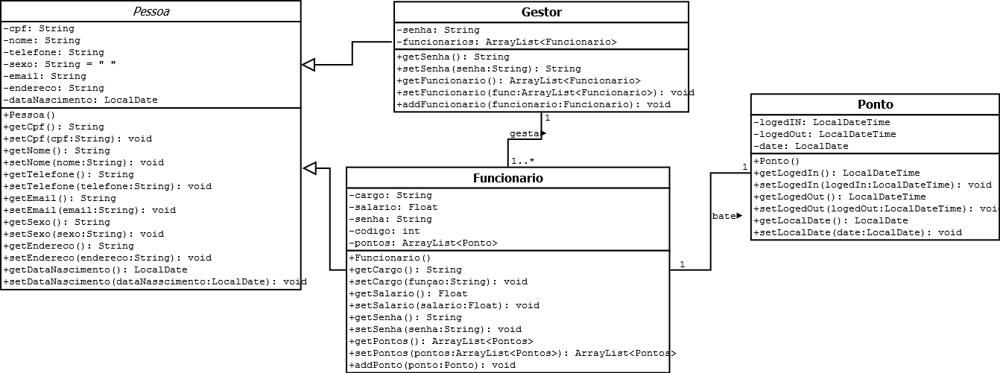

# SGF - Sistema de Gerenciamento de Funcionarios

    

## Projeto de TP1
Projeto GUI para a disciplina de Técnicas de Programação 1 (TP1), desenvolvido em Java usando Java Swing e banco de dados PostgreSQL.

## Proposta
Desenvolvimento de um software que auxilie na administração e gerenciamento de funcionários, podendo cadastra-los, fazer modificações, fazer levantamento de pesquisas com base nesses dados e também o gerenciamento de tempo de trabalho dos funcionários.

## Diagrama de classes

    

## Relatorio do projeto
<a href="./Relatório Final.pdf">Relatorio Final</a>

